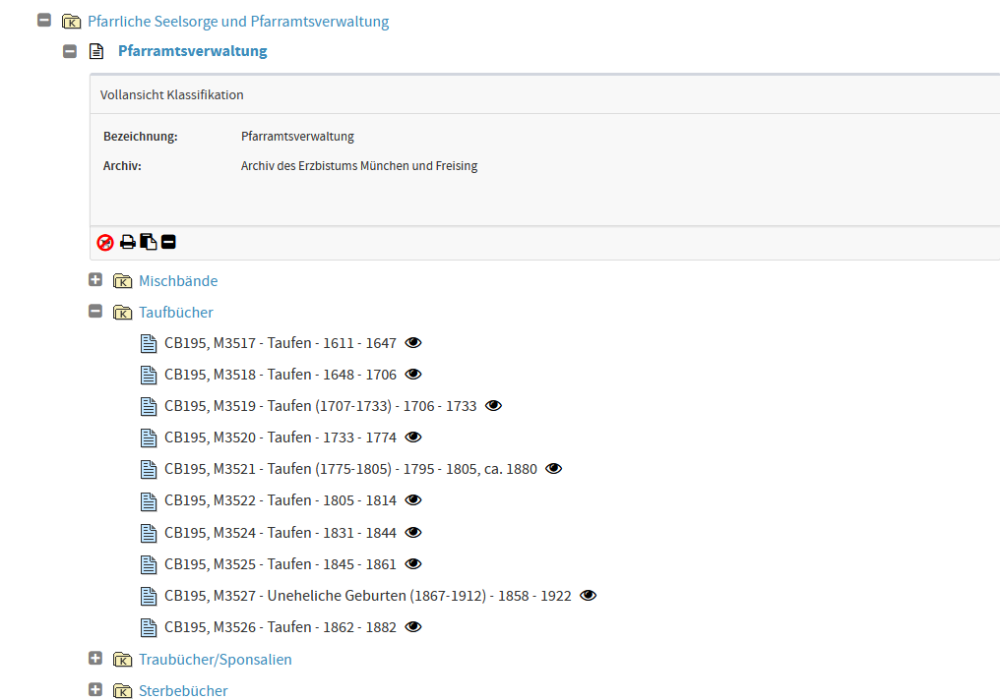
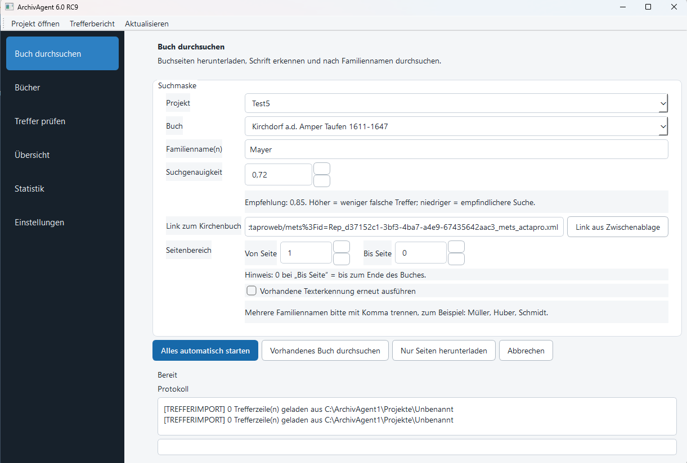
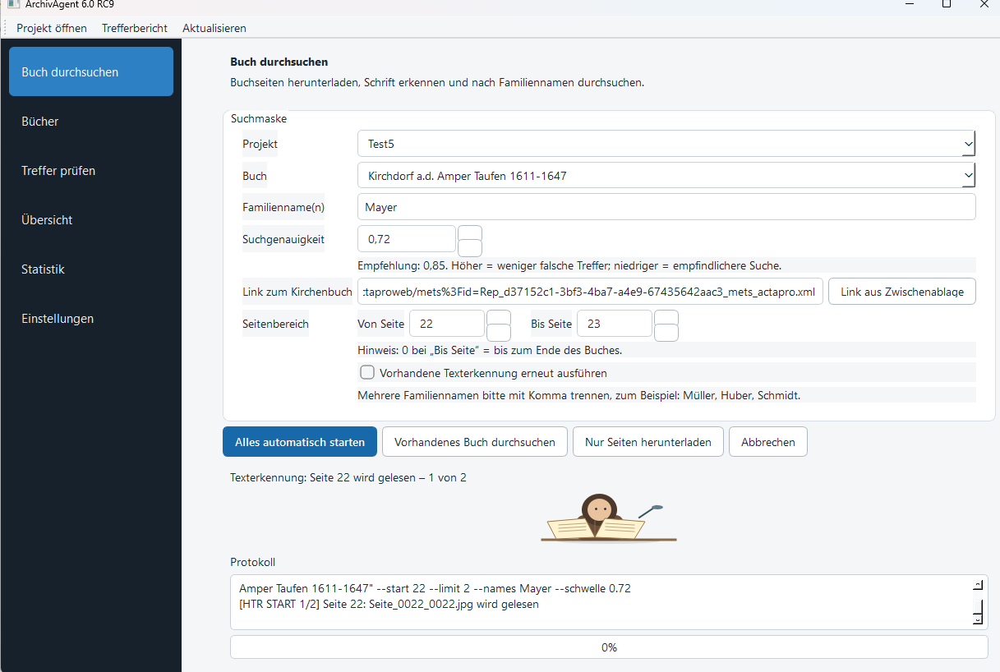

# ArchivAgent

ArchivAgent ist ein Windows-Programm zur unterstützten Recherche in digitalisierten
Kirchenbüchern, Urkunden, Amtsbüchern und weiteren historischen Archivalien. Es lädt
ausgewählte Seiten aus kompatiblen METS-/DFG-Viewern, erkennt Handschrift mit Kraken
OCR und durchsucht die Ergebnisse nach Familiennamen.

> **Testversion:** ArchivAgent 6.0 RC9 ist eine öffentliche Vorabversion. Bitte
> zunächst mit kleinen Seitenbereichen und Kopien wichtiger Forschungsdaten testen.

## Funktionen

- Buchseiten über einen METS-/DFG-Viewer-Link herunterladen
- frei wählbare Seitenbereiche verarbeiten
- historische Handschrift lokal mit Kraken OCR erkennen
- mehrere Familiennamen mit einstellbarer Suchgenauigkeit suchen
- Fundstellen mit Originalseite und erkanntem Text prüfen
- Projekte, Trefferlisten und Ergebnisse lokal speichern
- laufende Texterkennung mit Seitenfortschritt und animiertem Archivarius anzeigen
- laufende Vorgänge kontrolliert abbrechen

## Digitalisierte Archivalie aus einem DFG-Viewer übernehmen

1. Das gewünschte Dokument oder den gewünschten Band im Online-Archiv aufrufen.
2. Über **Augensymbol**, **Digitalisat**, **Viewer** oder **DFG-Viewer** die
   Bildansicht öffnen.
3. Sobald die digitalisierten Seiten sichtbar sind, mit `Strg + L` die vollständige
   Adresse aus der Browserzeile markieren und mit `Strg + C` kopieren.
4. Nicht die Bildadresse einer einzelnen Scan-Datei verwenden.
5. In ArchivAgent ein Projekt und einen aussagekräftigen Titel für die Archivalie
   eingeben.
6. **Link aus Zwischenablage** anklicken.
7. Familiennamen beziehungsweise Suchbegriffe und den gewünschten Seitenbereich
   angeben.
8. **Alles automatisch starten** wählen.

ArchivAgent liest die METS-Struktur des Viewers, lädt die ausgewählten Seiten, führt
die Handschriftenerkennung lokal aus und durchsucht den erkannten Text. Falls das
Archiv einen Link mit der Bezeichnung **METS**, **METS-XML** oder **DFG-Viewer**
anbietet, kann dieser direkt verwendet werden.

## Screenshots

### 1. Digitalisat im Online-Archiv auswählen

Über das Augensymbol wird die gewünschte Archivalie im DFG-Viewer geöffnet.

### 2. Viewer-Link und Suchangaben übernehmen

Projekt, Titel, Familiennamen und Seitenbereich eintragen und den kopierten
Viewer-Link über **Link aus Zwischenablage** übernehmen.

### 3. Download und Texterkennung starten

ArchivAgent lädt die ausgewählten Seiten und zeigt den Fortschritt während der
lokalen Handschriftenerkennung an.

## Systemvoraussetzungen

- Windows 10 oder Windows 11, 64 Bit
- Python 3.13
- Microsoft Visual C++ Redistributable (x64)
- Internetverbindung für Installation und Seitenabruf
- ausreichend freier Speicherplatz; Kraken und PyTorch benötigen mehrere Gigabyte

Die eigentliche Erkennung und Namenssuche erfolgt lokal auf dem Rechner. ArchivAgent
lädt OCR-Komponenten erst nach ausdrücklicher Zustimmung im OCR-Assistenten.

## Installation der Testversion

1. Unter **Releases** die Datei `ArchivAgent_Setup_6.0.0_RC9.exe` herunterladen.
2. Optional die SHA-256-Prüfsumme mit
   `ArchivAgent_Setup_6.0.0_RC9_SHA256.txt` vergleichen.
3. Setup starten und den Installationshinweisen folgen.
4. Im OCR-Assistenten Python und Microsoft Visual C++ prüfen.
5. Der Installation von Kraken zustimmen. Die erste Einrichtung kann einige Zeit dauern.

Der Installer ist derzeit nicht kommerziell codesigniert. Windows SmartScreen kann
deshalb eine Warnung anzeigen. Prüfen Sie Dateiname und SHA-256-Prüfsumme und laden
Sie die Datei ausschließlich aus diesem Repository herunter.

## Aktualisierung

Eine neue Version kann über die vorhandene Installation installiert werden. Projekte,
Modelle und die eingerichtete Kraken-Laufzeit bleiben erhalten, wenn derselbe
Installationsordner verwendet wird.

## Kurzer Testablauf

1. Ein neues Testprojekt und Buch anlegen.
2. Einen gültigen METS-/DFG-Viewer-Link einfügen.
3. Zunächst nur zwei oder drei Seiten auswählen.
4. **Alles automatisch starten** anklicken.
5. Download, Texterkennung, Trefferliste und Abbruchfunktion prüfen.

Ausführlichere Hinweise stehen in [TESTING.md](TESTING.md).

## Datenschutz

Projekte, heruntergeladene Seiten, erkannte Texte und Treffer werden lokal im
gewählten ArchivAgent-Ordner gespeichert. Es werden keine Forschungsdaten an einen
ArchivAgent-Server übertragen.

## Rückmeldungen und Fehlerberichte

Bitte unter **Issues** einen Fehlerbericht eröffnen. Hilfreich sind:

- Windows-Version
- ArchivAgent-Version
- verwendeter Viewer bzw. Archivtyp
- genaue Fehlermeldung
- relevante Protokollzeilen ohne private oder sensible Daten

## Lizenz und Danksagung

Der Programmcode steht unter der [GNU General Public License v3.0](LICENSE).

ArchivAgent verwendet Kraken OCR und ein Handschriftenmodell von **Stefan Weil**.
Das Modell wird unter **CC BY-SA 4.0** verwendet. Weitere Hinweise befinden sich in
[THIRD_PARTY_NOTICES.md](THIRD_PARTY_NOTICES.md) und im Ordner `licenses`.

## Aktive Weiterentwicklung

ArchivAgent wird kontinuierlich verbessert und um neue Funktionen erweitert. Hinweise
aus praktischen Tests fließen direkt in die weitere Entwicklung ein. Geplant und
teilweise bereits in Erprobung sind unter anderem der komfortable Import eigener
Scans, präzisere Treffer- und Zeilenmarkierungen sowie erweiterte Möglichkeiten zur
Korrektur historischer Handschriftenerkennung.

Neue Test- und Programmversionen werden im Bereich **Releases** veröffentlicht.
Änderungsvorschläge, Fehlerberichte und Erfahrungen mit unterschiedlichen Archiven
und Handschriften sind über die **GitHub-Issues** ausdrücklich willkommen.

## Status

Aktuelle Testversion: **ArchivAgent 6.0 RC9**

**Idee, Konzeption und Projektleitung: Frank Bernbeck**

Entwickelt mit KI-gestützter Entwicklungsunterstützung.
